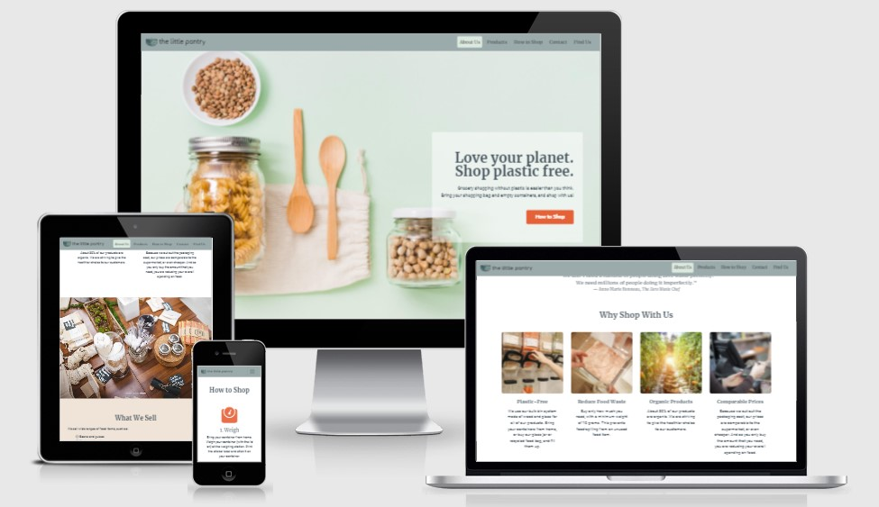
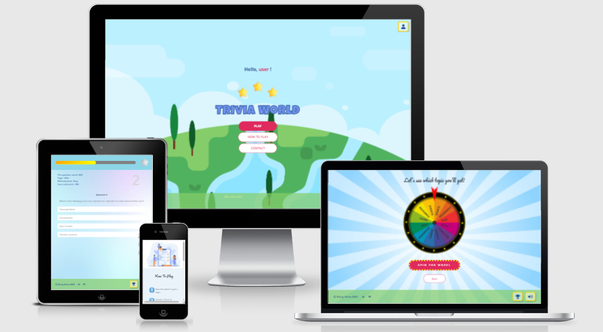
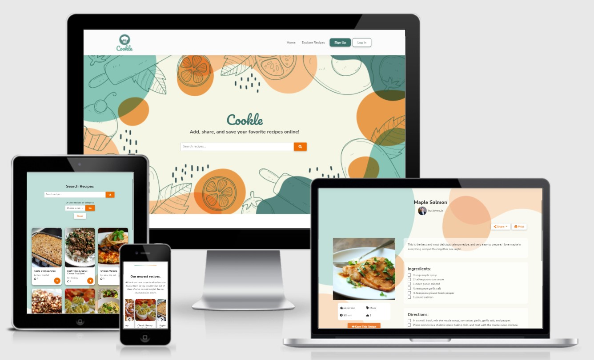

### Hi there 👋

My name is Dissy Ulina. I have a bachelor degree in Industrial Engineering and I'm currently learning to code. I enjoy making beautiful and creative websites, games, and apps. I love the whole process of building something, and I find it very rewarding to be able to see and experience the end result. Check out my pinned repositories to see my projects!

- 🔭 I’m currently working on completing my diploma in Full-Stack Software Development with Code Institute.
- 🌱 I’m currently learning Django and in the middle of building my first e-commerce website.
- 📫 Connect with me:  
  

 

## 💼**Technical Skill**
### **Languages**
   
   

### **Frameworks & Libraries**
   

### **Database Management**   
  

### **Version Control**  
      

### **Design**  
   

   

## 📈**GitHub Stats**  

   

## 🤩**Projects**  

- [**The Little Pantry**](https://dissyulina.github.io/the-little-pantry/): a static website for a fictional business (HTML, CSS, Bootstrap)   
  

- [**Trivia World**](https://dissyulina.github.io/trivia-world/index.html): a web-based interactive quiz game (HTML, CSS, JavaScript, Bootstrap, jQuery)  
   

- [**Cookle**](https://cookle-cookbook.herokuapp.com/): a recipe-sharing and online cookbook web application (HTML, CSS, JavaScript, Python, Material Design Bootstrap, jQuery, Flask, Jinja, MongoDB)  
  

Check out the link to the repositories below! 👇

