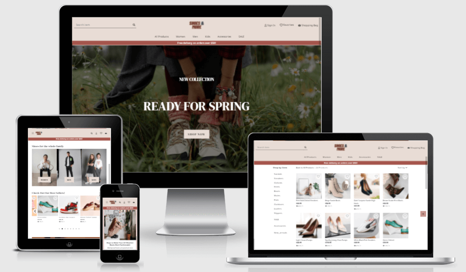

### Hi there 👋

I'm Dissy, a software developer. I love the whole process of solving problems by building websites, apps or softwares. I find it very rewarding to be able to see and experience the end result. Check out my pinned repositories to see my projects!

- 🔭 Graduated in Full Stack Software Development Program at Code Institute.
- 📫 Connect with me:  
  

 

## 💼**Technical Skill**
### **Languages**
       

### **Frameworks & Libraries**
                

### **Database Management**   
     

### **Version Control**  
      

### **Design**  
   

   

## 🤩**Projects**  

- [**The Little Pantry**](https://dissyulina.github.io/the-little-pantry/): a static website for a fictional business (HTML, CSS, Bootstrap)   
  

- [**Trivia World**](https://dissyulina.github.io/trivia-world/index.html): a web-based interactive quiz game (HTML, CSS, JavaScript, Bootstrap, jQuery)  
   

- [**Cookle**](https://cookle-cookbook.onrender.com/): a recipe-sharing and online cookbook web application (HTML, CSS, JavaScript, Python, Material Design Bootstrap, jQuery, Flask, Jinja, MongoDB)  
  

- [**Shoes And More**](https://shoesandmore.onrender.com/): a full stack e-commerce shop selling shoes and accessories (HTML, CSS, JavaScript, Python, Django, Bootstrap, jQuery, Postgres, AWS S3, Stripe)   
  

Check out the link to the repositories below! 👇

